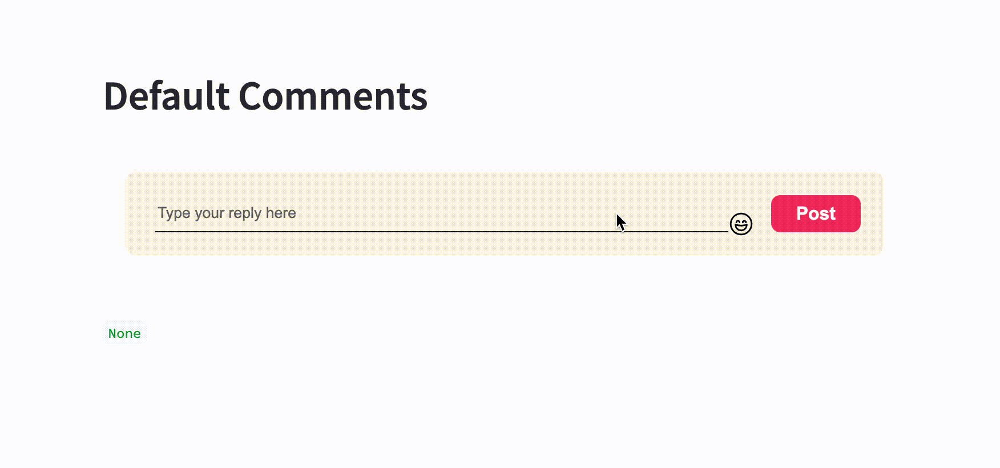
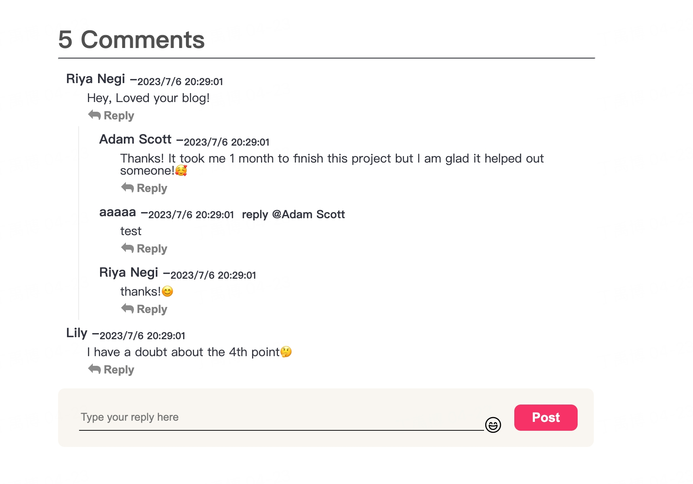
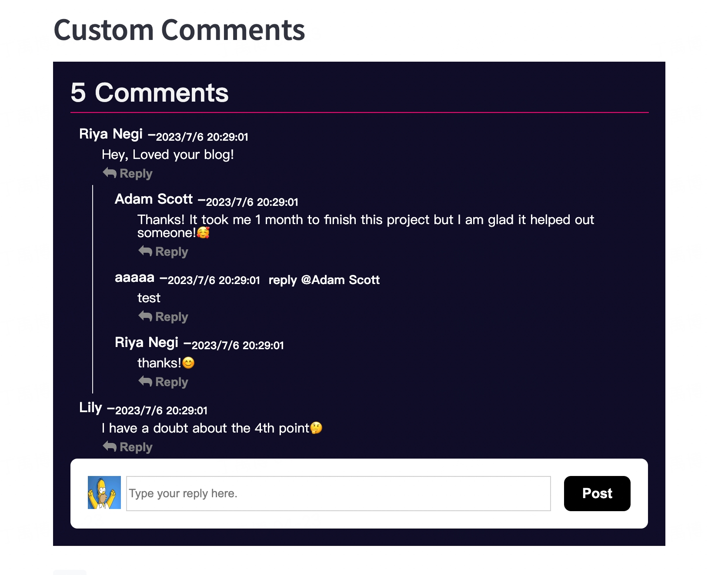
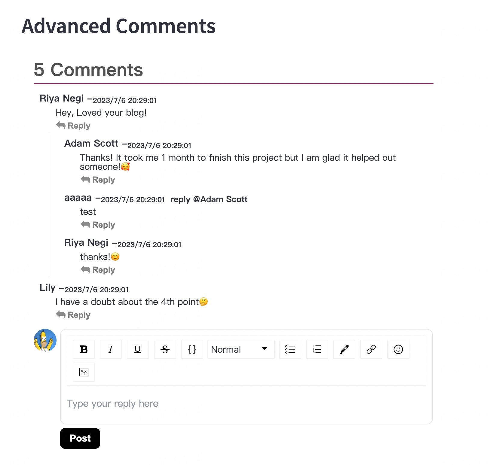

# streamlit-comments supports replies and multi-level replies.

```bash
pip install streamlit-comments
```


```python
event = st_comments(
    key="test",
    currentUserId="01a",
    currentUserFullName="Riya Negi",
    titleStyle={ "display": "none" },
    hrStyle={ "display": "none" },
    commentData=[],
    customNoComment=" ",
)
```
---


```python
test_data = [
    {
        "userId": "01a",
        "comId": "012",
        "fullName": "Riya Negi",
        "text": "Hey, Loved your blog! ",
        "createdTime": 1688646541266,
        "replies": [
            {
                "userId": "02a",
                "comId": "013",
                "fullName": "Adam Scott",
                "createdTime": 1688646541266,
                "text": "Thanks! It took me 1 month to finish this project but I am glad it helped out someone!🥰",
                "replies": [
                    {
                        "userId": "05a",
                        "comId": "020",
                        "fullName": "aaaaa",
                        "createdTime": 1688646541266,
                        "text": "test",
                    }
                ]
            },
            {
                "userId": "01a",
                "comId": "014",
                "fullName": "Riya Negi",
                "text": "thanks!😊",
                "createdTime": 1688646541266,
            }
        ]
        },
    {
        "userId": "02b",
        "comId": "017",
        "fullName": "Lily",
        "text": "I have a doubt about the 4th point🤔",
        "replies": [],
        "createdTime": 1688646541266,
    }
]

event = st_comments(
    key="test2",
    currentUserId="01a",
    currentUserFullName="Riya Negi",
    commentData=test_data,
)
st.write(event)
```

---


```python
   event = st_comments(
      key="test3",
      currentUserId="01a",
      currentUserFullName="Riya Negi",
      currentUserImg="https://ui-avatars.com/api/name=Riya&background=random",
      hrStyle={ "border": '0.5px solid #ff0072' },
      titleStyle={ "color": '#f2f2f2' },
      commentsCount=5,
      commentData=test_data,
      imgStyle={ "borderRadius": '0%' },
      customImg='https://imagesvc.meredithcorp.io/v3/mm/image?url=https%3A%2F%2Fstatic.onecms.io%2Fwp-content%2Fuploads%2Fsites%2F13%2F2015%2F04%2F05%2Ffeatured.jpg&q=60',
      inputStyle={ "border": '1px solid rgb(208 208 208)' },
      formStyle={ "backgroundColor": 'white' },
      submitBtnStyle={ "border": '1px solid black', "backgroundColor": 'black' },
      cancelBtnStyle={
        "border": '1px solid gray',
        "backgroundColor": 'gray',
        "color": 'white',
      },
      removeEmoji=True,
      overlayStyle={ "backgroundColor": '#0f0d29', "color": 'white' },
      replyInputStyle={ "borderBottom": '1px solid black', "color": 'black' },
  )
  st.write(event)
```

---


```python
  event = st_comments(
      key="test4",
      currentUserId='01a',
      currentUserImg='https://ui-avatars.com/api/name=Riya&background=random',
      currentUserFullName='Riya Negi',
      hrStyle={ "border": '0.5px solid #ff0072' },
      commentData=test_data,
      customImg='https://imagesvc.meredithcorp.io/v3/mm/image?url=https%3A%2F%2Fstatic.onecms.io%2Fwp-content%2Fuploads%2Fsites%2F13%2F2015%2F04%2F05%2Ffeatured.jpg&q=60',
      inputStyle={ "border": '1px solid rgb(208 208 208)' },
      formStyle={ "backgroundColor": 'white' },
      submitBtnStyle={
        "border": '1px solid black',
        "backgroundColor": 'black',
        "padding": '7px 15px',
      },
      cancelBtnStyle={
        "border": '1px solid gray',
        "backgroundColor": 'gray',
        "color": 'white',
        "padding": '7px 15px'
      },
      advancedInput=True,
      replyInputStyle={ "borderBottom": '1px solid black', "color": 'black' },
  )
```
